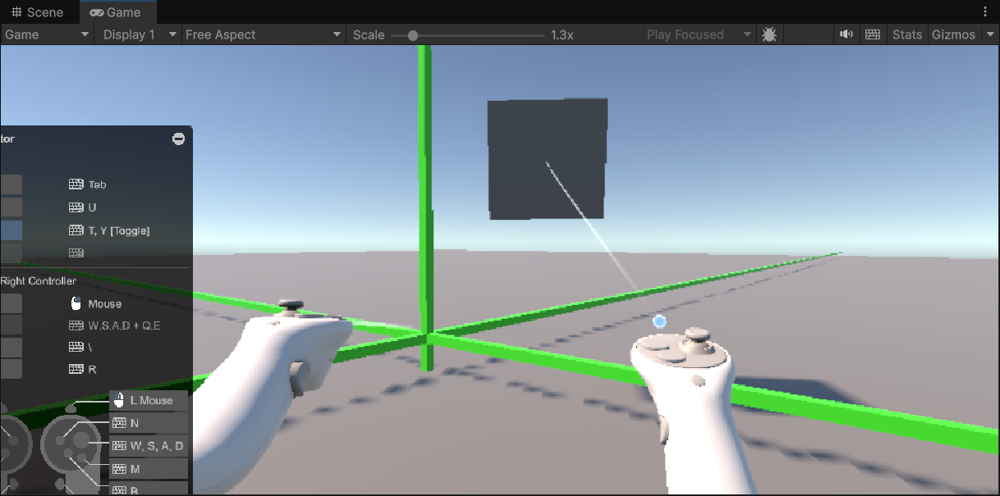
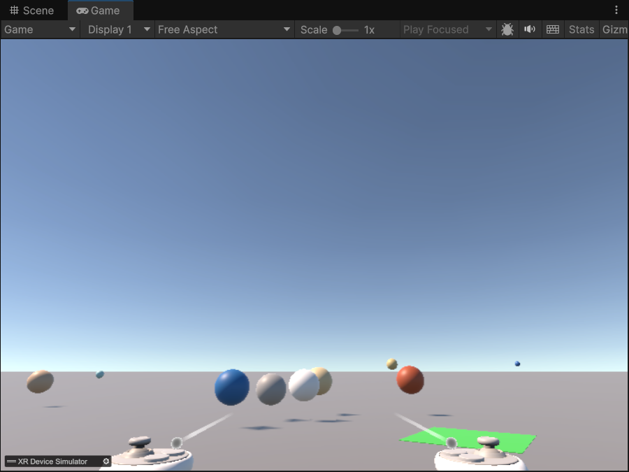
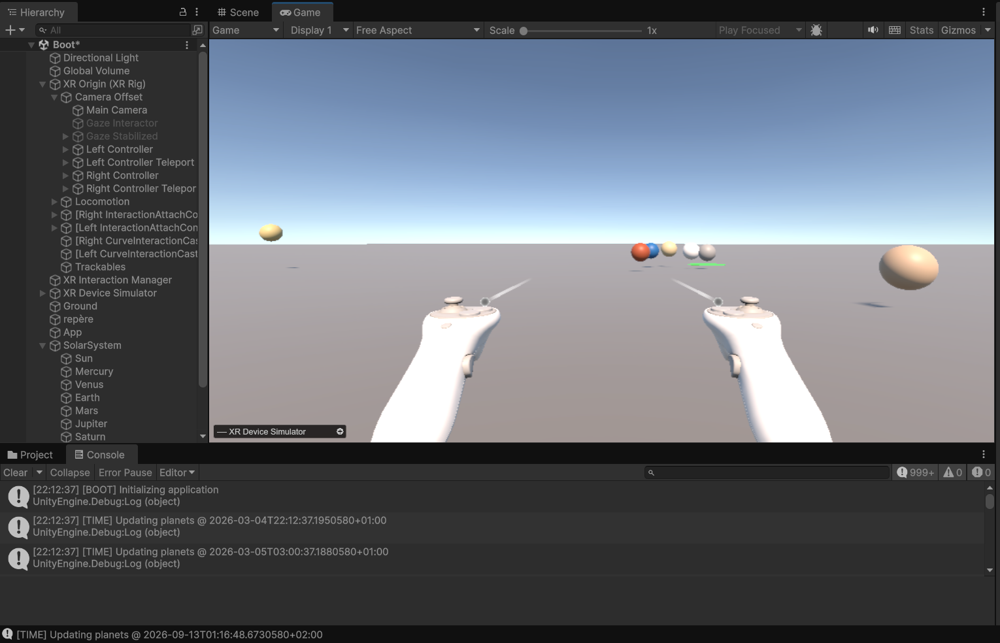
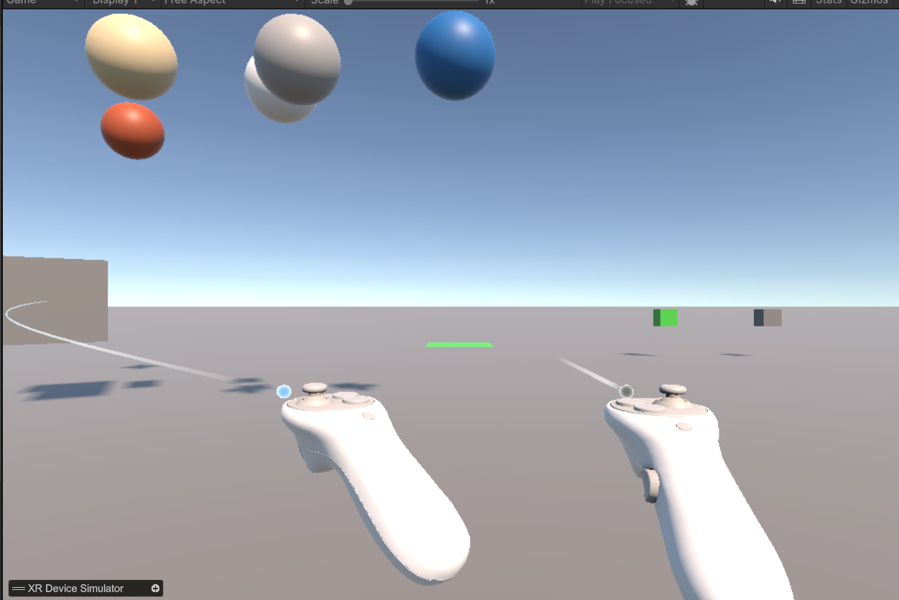
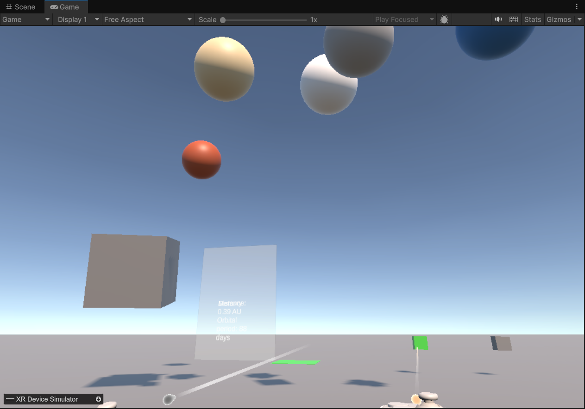
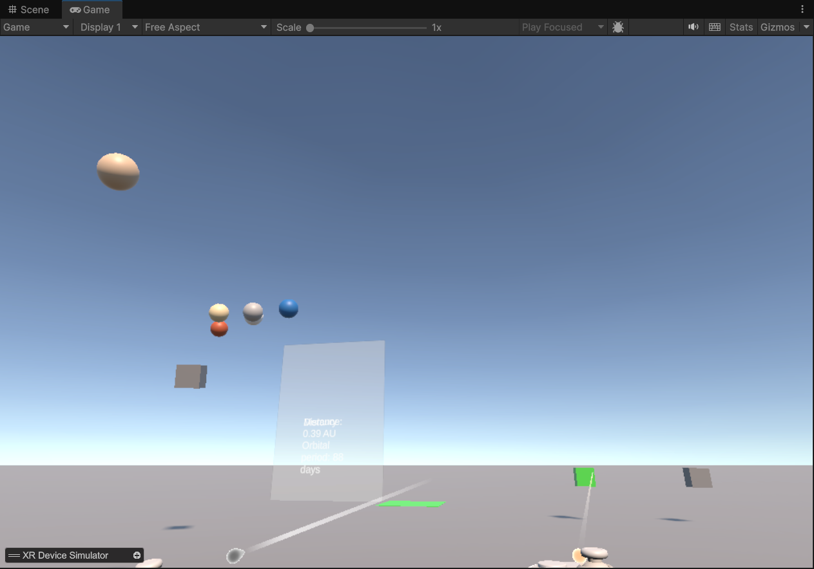
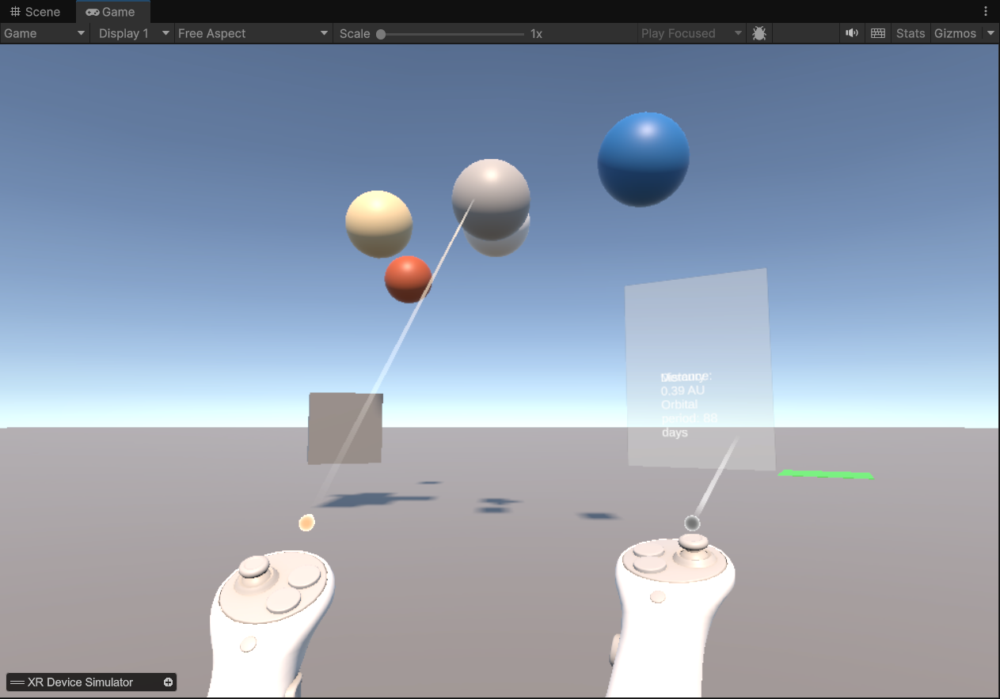
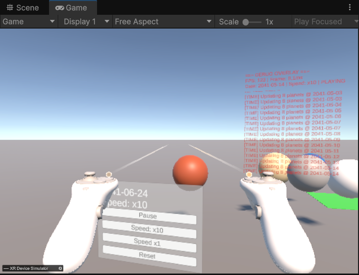

Repository: https://github.com/sleepwithoutawake/Solar-System

# Solar System VR Workbench

A VR application built with **Unity 6.3 LTS** + **XR Interaction Toolkit**,
allowing users to visualize and interact with a 3D solar system model
using real orbital data.

Tested with **XR Device Simulator** (no headset required for development).

---

## Screenshots

### Step 1 - Grabbing the test cube (XR boot validation)


### Solar system view with all planets visible


### Planets orbiting in simulation


### Grabbing and moving the solar system


### Scale up - zooming in


### Scale down - zooming out


### Planet info panel on selection


### World-space UI control panel + Debug Overlay


---

## Architecture

```text
Bootstrap Layer
`-- AppBootstrapper
    |-- creates TimeModel
    |   |-- OnTimeChanged event
    |   `-- creates PlanetSystemController
    |       |-- uses PlanetEphemerisService
    |       `-- calls PlanetData (static, provided)
    |-- inits TimeController
    |   `-- advances TimeModel each frame
    |-- inits UIController
    |   `-- play/pause, speed, reset
    `-- inits DebugOverlay
        `-- FPS, date, speed, last logs

View Layer
`-- PlanetView[] <- SetPosition() called by PlanetSystemController
```

### Data flow

```text
TimeController.Update()
    -> TimeModel.SetTime()
        -> OnTimeChanged event fires
            -> PlanetSystemController.UpdatePlanets()
                -> PlanetEphemerisService.GetPlanetPosition()
                    -> PlanetData.GetPlanetPosition() (static)
                        -> PlanetView.SetPosition()
```

### Folder structure

```text
Assets/Scripts/
|-- Bootstrap/      AppBootstrapper.cs
|-- Models/         TimeModel.cs
|-- Services/       IPlanetEphemerisService.cs
|                   PlanetEphemerisService.cs
|-- Controllers/    PlanetSystemController.cs
|                   TimeController.cs
|                   UIController.cs
|                   ScaleController.cs
|                   FocusController.cs
|                   SolarSystemGrabHandler.cs
|-- Views/          PlanetView.cs
|                   PlanetSelectable.cs
|                   GrabHandler.cs
|                   DebugOverlay.cs
`-- Config/         SolarSystemConfig.cs
```

---

## Features

- Solar system simulation with real orbital data (PlanetData)
- Manipulable tabletop - grab and move the entire solar system
- Scale control - zoom in/out with dedicated buttons
- Planet selection with ray interactor - shows info panel
- World-space UI - play/pause, speed x1/x10/x100, reset scale
- Debug Overlay - FPS, current date, speed, last structured logs

---

## Engineering Rules Applied

- No `FindObjectOfType` or `GameObject.Find` anywhere in the codebase
- `Update()` is used by `TimeController` (time progression), `SolarSystemGrabHandler` (follow while grabbed), and `DebugOverlay` (periodic FPS/UI refresh)
- All dependencies injected explicitly via `AppBootstrapper` (composition root)
- Model (`TimeModel`) is pure C#, no Unity dependency
- Structured logs throughout: `[BOOT]` `[TIME]` `[INPUT]` `[XR]` `[WARN]` `[PERF]`

---

## Debug Story

### Ticket B - Double event subscription after scene reload

**Repro:**
When the scene reloads, a new `PlanetSystemController` is created
and subscribes to `OnTimeChanged`. If the previous instance was not
properly cleaned up, both instances receive the event, causing
`UpdatePlanets` to be called twice per frame.

**Method:**
1. **Instrumentation** - added a frame counter guard in `UpdatePlanets`
   to detect if it is called more than once per frame
2. **Hypothesis** - `OnTimeChanged` has multiple active subscribers
   after a reload
3. **Test** - confirmed: after scene reload, `[WARN] UpdatePlanets called
   twice in frame X` appeared in the console
4. **Fix** - added `Dispose()` method to `PlanetSystemController`,
   called in `AppBootstrapper.OnDestroy()`

**Non-regression test:**
If `UpdatePlanets` is called twice in the same frame, a `[WARN]` is
logged and the duplicate call returns immediately without processing.

```csharp
if (Time.frameCount == lastUpdateFrame)
{
    Debug.LogWarning("[WARN] UpdatePlanets called twice in frame " + Time.frameCount);
    return;
}
lastUpdateFrame = Time.frameCount;
```

---

### Ticket C - Inconsistent scale, planets out of view

**Repro:**
With linear scaling (`pos * 2f`), Neptune at 30 AU appears at
60 Unity units - far outside the visible tabletop range.
Mercury at 0.39 AU appears at only 0.78 units.
The visible ratio between the nearest and farthest planet is 77x,
making it impossible to see all planets at once.

**Method:**
1. **Instrumentation** - logged raw AU distance and scaled distance
   for each planet on every update call
2. **Hypothesis** - linear scaling does not fit the solar system's
   distance distribution
3. **Test** - confirmed: Mercury at 0.78 units vs Neptune at 60 units
4. **Fix** - replaced linear scale with logarithmic compression:
   `Log(1 + distance) * 2f`

**Result after fix:**

| Planet  | Raw distance | Linear scale | Log scale |
|---------|-------------|--------------|-----------|
| Mercury | 0.39 AU     | 0.78 units   | 0.67 units |
| Earth   | 1.00 AU     | 2.00 units   | 1.39 units |
| Jupiter | 5.20 AU     | 10.4 units   | 3.61 units |
| Neptune | 30.0 AU     | 60.0 units   | 6.84 units |

Max ratio reduced from **77x** to **~10x** - all planets visible.

**Non-regression test:**
After scaling, if any planet exceeds 15 Unity units, a `[WARN]` is
logged with the planet name and distance.

```csharp
if (scaledPos.magnitude > 15f)
    Debug.LogWarning("[WARN] " + planet.planet
        + " still far after scaling: " + scaledPos.magnitude.ToString("F2") + " units");
```

---

## Git Tags

| Tag | Description |
|-----|-------------|
| `v1.0-boot` | Boot XR + minimal scene with grab cube |
| `v1.1-architecture` | Architecture: models, services, controllers |
| `v1.2-events` | Time simulation with events, planets moving |
| `v1.3` | VR interactions: grab, scale, planet selection |
| `v1.4` | World-space UI + debug overlay |
| `v1.5` | Debug tickets B and C |
